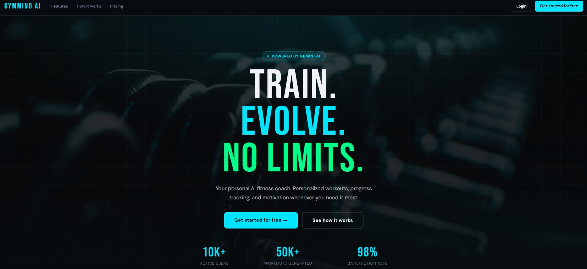
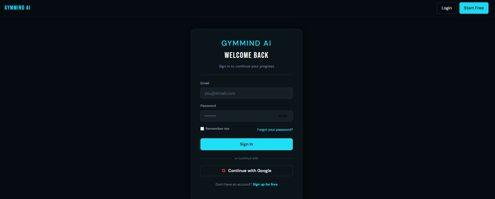
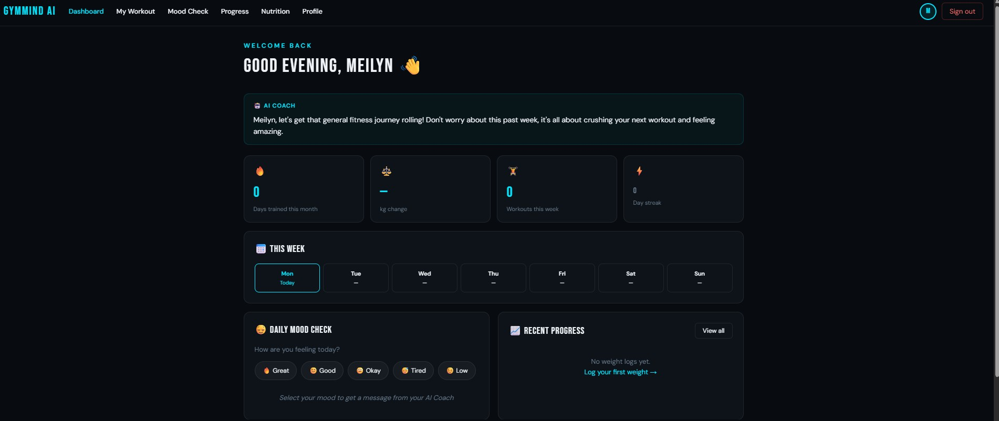
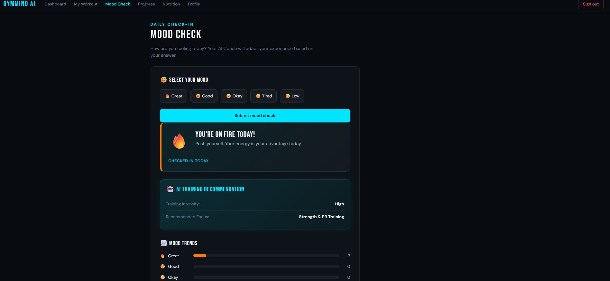
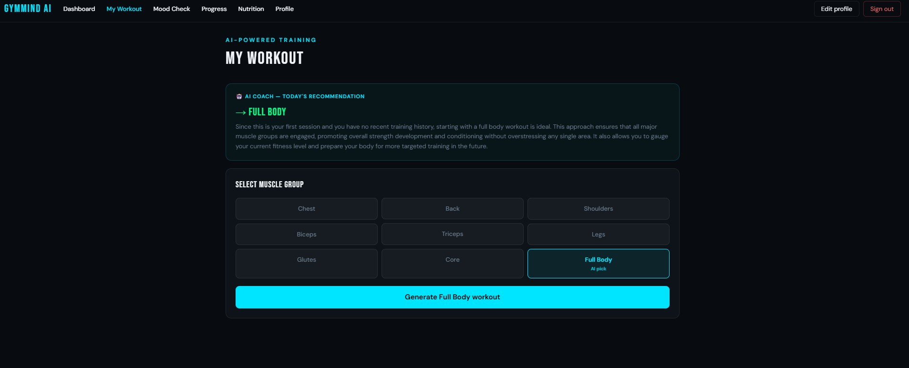

# 🏋️ GymMind AI




---

# 📖 Overview

GymMind AI is a full-stack wellness web application developed as the final project for the **4Geeks Academy Full Stack Software Development Bootcamp**.

The application helps users build healthier habits by combining mood tracking, workout management, nutrition guidance, and AI-powered recommendations in a single platform.

The project was developed collaboratively following Agile practices and Git Flow, simulating a professional software development environment.

---

# ✨ Features

- 🔐 User Authentication with JWT
- 👤 User Registration & Login
- 🔒 Protected Routes
- 😊 Mood Tracking
- 🤖 AI-Powered Recommendations
- 💪 Workout Management
- 🥗 Nutrition Section
- 📈 Progress Tracking
- 👤 User Profile Management
- 📱 Responsive Interface

---

# 🛠️ Tech Stack

## Frontend

- React
- Vite
- JavaScript (ES6+)
- HTML5
- CSS3
- Bootstrap

## Backend

- Python
- Flask
- SQLAlchemy
- Flask-JWT-Extended
- REST API

## Database

- PostgreSQL

## Tools

- Git
- GitHub
- Pipenv
- Render

---

# 👩‍💻 My Contributions

This project was developed collaboratively by a team during the bootcamp.

My primary contributions included:

- Implemented JWT authentication.
- Developed Login and Logout functionality.
- Protected authenticated routes.
- Developed the Mood Check feature.
- Connected frontend components with backend REST APIs.
- Debugged authentication and routing issues.
- Collaborated during feature integration and testing.
- Participated in code reviews and Pull Request validation.

---

# 🤝 Team Collaboration

The project was developed using a collaborative Git workflow similar to real-world software development.

Our workflow included:

- Working with feature branches.
- Git Flow branching strategy.
- Pull Requests for every completed feature.
- Code reviews before merging.
- Merge conflict resolution.
- Collaborative feature integration.
- Team communication throughout the development process.

This experience strengthened both technical and collaborative software development skills.

---

# 🏗️ Architecture

```
React + Vite
      │
 REST API (Flask)
      │
 SQLAlchemy ORM
      │
 PostgreSQL
```

---

# 🚀 Installation

## Clone the repository

```bash
git clone https://github.com/meylin103/GymMind.git
```

## Backend

Install dependencies

```bash
pipenv install
```

Create the environment file

```bash
cp .env.example .env
```

Run database migrations

```bash
pipenv run migrate
pipenv run upgrade
```

Start the backend

```bash
pipenv run start
```

---

## Frontend

Install dependencies

```bash
npm install
```

Run the development server

```bash
npm run dev
```

---

# 📂 Project Structure

```
src/
├── api/
├── components/
├── pages/
├── services/
├── styles/
├── migrations/
└── models/
```

---

# 📸 Screenshots

| Login | Dashboard |

|  |  |

---

## Mood Check

  

---

## Workout

 

---

# 🔒 Authentication

Authentication is implemented using JSON Web Tokens (JWT) to secure user sessions and protect private routes.

---

# 🤖 AI Integration

The application integrates Generative AI to provide personalized wellness recommendations based on user mood entries.

---

# 🌱 Future Improvements

- Dashboard analytics
- Mobile responsive improvements
- Push notifications
- Docker support
- Automated testing
- CI/CD pipeline
- Enhanced AI recommendations
- Additional health metrics

---

# 🎓 What I Learned

During this project I gained hands-on experience with:

- Full Stack Web Development
- React
- Flask
- REST API development
- JWT Authentication
- PostgreSQL
- SQLAlchemy
- Git & GitHub
- Git Flow
- Pull Requests
- Team Collaboration
- Deployment with Render

---

# 📄 License

This project was developed for educational purposes and is part of my professional software development portfolio.